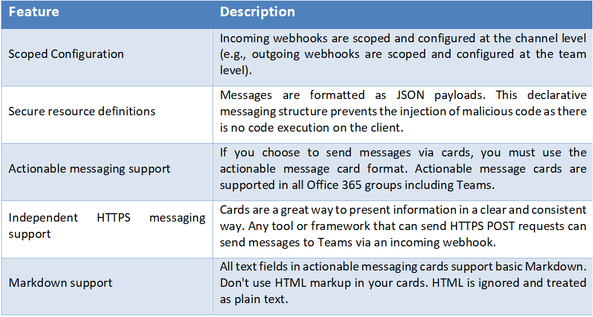
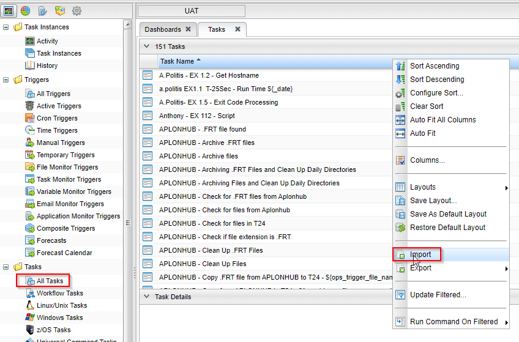
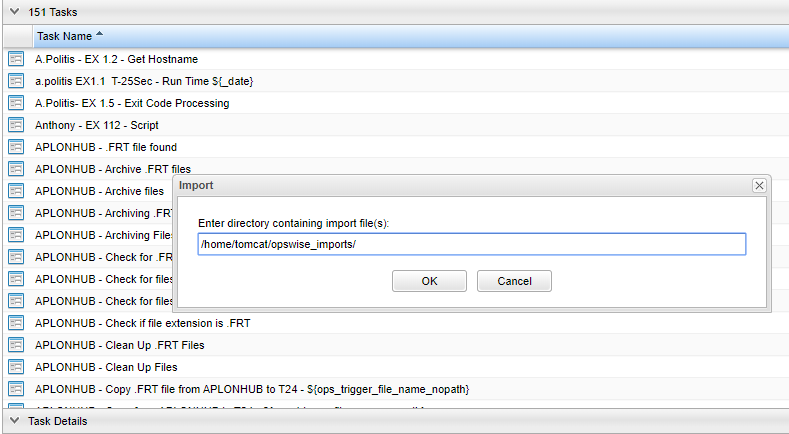
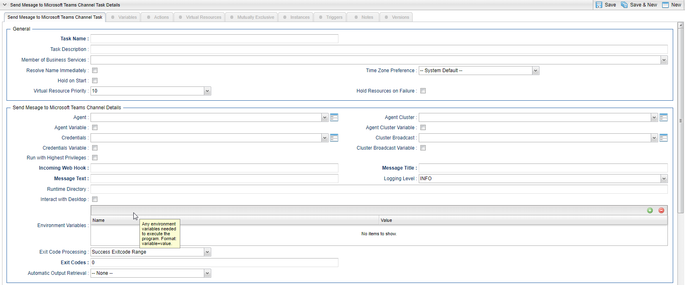
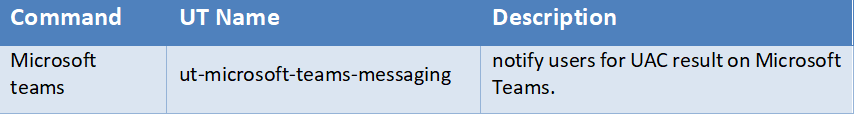
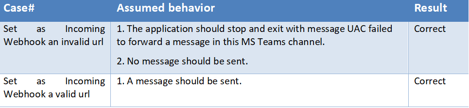
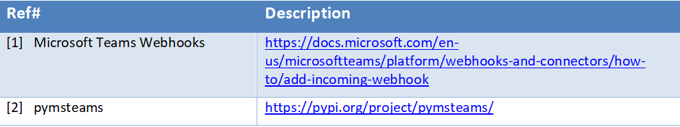

# ut-microsoft-teams-messaging
Universal Automation Center support for Microsoft Teams Notifications Forwarding.

# Abstract: 
The here described Universal Tasks allow to send messages to an existing channel of Microsoft Teams. As a result, you can integrate this 
solution in UAC to notify users for UAC result on Microsoft Teams

# 1	Disclaimer
No support and no warranty are provided by Stonebranch GmbH for this document and the related Universal Task. The use of this document and 
the related Universal Task is on your own risk.
Before using this task in a production system, please perform extensive testing.
Stonebranch GmbH assumes no liability for damage caused by the performance of the Universal Tasks

# 2	Scope 
This document provides a documentation how to install and use the Universal Tasks for Microsoft Teams Notifications Forwarding. If more 
Task will be created in the future this document will be updated accordingly.  

# 3	Introduction
# 3.1	Incoming Webhooks in MS Teams
Incoming webhooks are special type of Connectors in MS Teams that provide a simple way for an external app to share content in team 
channels and are often used as tracking and notification tools. MS Teams provides a unique URL to which you send a JSON payload with the 
message that you want to POST, typically in a card format. Cards are user-interface (UI) containers that contain content and actions 
related to a single topic and are a way to present message data in a consistent way. Teams uses cards within three capabilities:

    •	Bots
    •	Messaging extensions
    •	Connectors
    
# 3.2	Adding an incoming webhook to a MS Teams channel
**Note:** If your MS Team's Settings => Member permissions => Allow members to create, update, and remove connectors is selected, any team member can add, modify, or delete a connector.[1]

    1.	Navigate to the channel where you want to add the webhook and select (•••) More Options from the top navigation bar.
    2.	Choose Connectors from the drop-down menu and search for Incoming Webhook.
    3.	Select the Configure button, provide a name, and, optionally, upload an image avatar for your webhook.
    4.	The dialog window will present a unique URL that will map to the channel. Make sure that you copy and save the URL—you will need to provide it to the outside service.
    5.	Select the Done button. The webhook will be available in the team channel.

# 3.3	Incoming Webhooks key features

Image 1:

# 3.4	Python Integration

pymsteams [2] is a Python Wrapper Library to send requests to Microsoft Teams Webhooks. Microsoft refers to these messages as Connector 
Cards. A message can be sent with only the main Connector Card, or additional sections can be included into the message. This library 
uses Webhook Connectors for Microsoft Teams.

# 3.5	Implementation Details

Some details about the universal tasks for MS Teams:

    •	Supports logging functionality, by selecting the log level by yourself (INFO, DEBUG, etc)
    •	Uses pymsteams python library
    •	Accepts as input parameters the log level, an incoming webhook a title and a text of the message 
    •	Set up the connection from UAC to MS Teams channel using webhooks
    •	Set up the message is about to send and forwards it to the channel
    •	No authentication is supported 
    •	The Universal Task supports both Universal Agent for Linux/Unix and Windows  and has been tested in both systems
   
# 4	Installation
# 4.1	Software Requirements for Linux Agent
**Universal Task name:** ut-microsoft-teams-messaging
**Requirements: **

    •	Python 3.6
    •	For Python the following modules are required: 
        •	sys, for system-specific parameters and functions
        •	pymsteams, to interact with a Microsoft Teams channel
        •	logging, for python loglevel support
        **Note:** Only the module pymsteams needs to be added via python installer 
            •pip install pymsteams
    •	Universal Controller V6.4.7.0 or higher
    •	Universal Agent V6.5.0.0 or higher installed on a Linux/Windows Server

# 4.2	Installation Steps

The following describes the installation steps:

**1.	Check the current Python Version**

    python -V  (Note: Capital “V”)

If your Version is Python 3.6 or later all is fine. If a no python or a lower Version has been installed upgrade your python Version or 
install the Universal Agent with the Python binding option (--python yes). This option will install python 3.6. along with your 
universal agent.

e.g.

    sudo sh ./unvinst --network_provider oms --oms_servers 7878@192.168.88.12 --oms_port 7878 --oms_autostart no --ac_netname OPSAUTOCONF --opscli yes --python yes

**2.	Add the required python modules**

In a command shell run as sudo or root:
    
    •	For Python the following modules are required: 
        •	pip install pymsteams
        or in case of universal Agent with python binding: 
        /opt/universal/python3.6/bin/python3 -m pip install pymsteams
        
        Only run these if not available already:
        •	pip install sys
        •	pip install logging

**Note:**

It is assumed that the modules logging, sys, datetime, os are already available. If not install them via pip. Only the module pymsteams is not part of your installation.

**3.	Import MS Teams Universal Task including the Universal Template to your Controller**

Go to “All Tasks” and load via the Import functionality the Universal Tasks configuration into the Controller. 

Image 2:

Image 3:

# 5	Universal Task Configuration

**1.	Fill Out MS Teams Universal Task:**

Image 4:

# 6	Universal Tasks for MS Teams Notifications Forwarding

The following chapter describes the provided MS Teams Notifications Forwarding Universal Tasks.

# 6.1	ut-microsoft-teams-messaging

Image 5:

**Field Description:**

Image 6:

# 7	Test Cases

The following basic test cases has been performed:

Image 7:

# 8	Document References

This document references the following documents:

Image 8:

